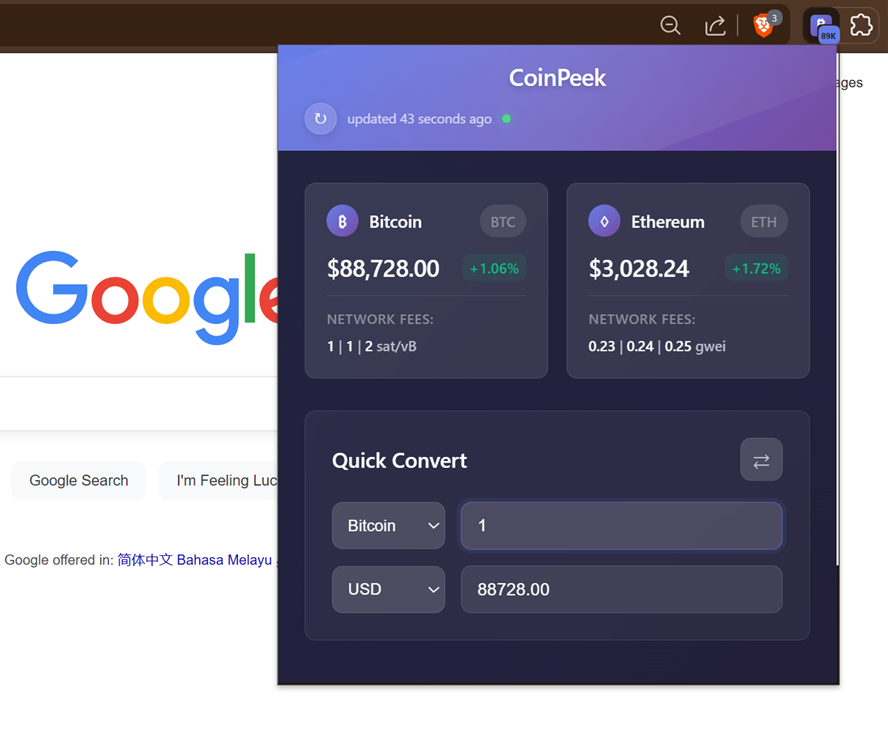

# CoinPeek - Bitcoin Price Badge & Gas Tracker

[](https://github.com/devacc8/coinpeek/releases)
[](LICENSE)
[](https://chromewebstore.google.com/detail/btc-price-bage-tracker/konlmcdlofpoegdkbjocdfojejmfkfbo)

A fast, lightweight Chrome extension that shows real-time Bitcoin price on the extension badge, plus ETH prices, gas fees, and a crypto converter.



## 🚀 Features

- **Real-time Prices**: Monitor Bitcoin and Ethereum prices with 24-hour change indicators
- **Gas Fee Tracking**: View current network fees for both Bitcoin and Ethereum networks
- **Smart Converter**: Convert between BTC, ETH, and USD with live exchange rates
- **Modern Interface**: Clean, responsive design with gradient styling
- **Background Updates**: Automatic price updates every minute via service worker
- **Badge Display**: Bitcoin price shown in extension badge for quick reference
- **Optimized Performance**: Enhanced codebase with reduced memory footprint

## 📦 Installation

### From Chrome Web Store (Recommended)
**[Install from Chrome Web Store](https://chromewebstore.google.com/detail/btc-price-bage-tracker/konlmcdlofpoegdkbjocdfojejmfkfbo)**

### Manual Installation (Developer Mode)
1. Download or clone this repository
2. Open Chrome and navigate to `chrome://extensions/`
3. Enable "Developer mode" in the top right corner
4. Click "Load unpacked" and select the extension folder
5. The extension icon will appear in your Chrome toolbar

## 🎯 Usage

### Basic Usage
- **View Prices**: Click the extension icon to see current BTC/ETH prices
- **Check Gas Fees**: Network fees are displayed inline with each currency
- **Convert Currencies**: Use the bottom converter for quick calculations
- **Manual Refresh**: Click the refresh button (↻) for instant updates

### Advanced Features
- **Swap Currencies**: Click the ⇄ button to quickly reverse conversion direction
- **Badge Monitoring**: Bitcoin price is always visible in the extension badge
- **Offline Support**: Last known prices cached for offline viewing

## 🔧 Technical Stack

### Architecture
- **Frontend**: Vanilla JavaScript (ES6+), CSS3 with modern gradients
- **Backend**: Chrome Service Worker (Manifest V3)
- **Storage**: Chrome Storage API for data persistence
- **Updates**: Chrome Alarms API for background synchronization

### Performance Optimizations (v1.1.0)
- ✅ Eliminated code duplication (removed ~25% of codebase)
- ✅ Centralized configuration management
- ✅ Optimized DOM element caching
- ✅ Unified API call architecture
- ✅ Enhanced error handling with fallbacks

## 🌐 API Integration

### Primary Data Sources
| Service | Purpose | Fallback Available |
|---------|---------|-------------------|
| **CoinGecko** | BTC/ETH prices | ❌ (Primary only) |
| **Blocknative** | Ethereum gas fees | ✅ (Default values) |
| **mempool.space** | Bitcoin gas fees | ✅ (2 additional APIs) |

### Reliability Features
- Multiple Bitcoin gas fee APIs with automatic failover
- Graceful degradation to cached data during outages
- Default gas values when all APIs are unavailable

## 🛠️ Development

### Project Structure
```
coinpeek/
├── manifest.json           # Extension configuration
├── background-simple.js    # Optimized service worker
├── popup/                  # User interface
│   ├── popup.html
│   ├── popup.css
│   └── popup.js
├── config/
│   └── constants.js        # Centralized configuration
├── utils/
│   └── formatters.js       # Shared utilities
├── icons/                  # Extension icons (16, 48, 128px)
├── dev-tools/              # Development utilities (optional)
└── docs/
    ├── README.md           # This file
    └── TECHNICAL_DOCS.md   # Developer documentation
```

### Development Setup
1. Clone the repository
2. Make your changes
3. Reload extension in `chrome://extensions/`
4. Test functionality in popup and background service

### Adding Features
- Review `TECHNICAL_DOCS.md` for architecture guidelines
- Use centralized constants in `config/constants.js`
- Follow the established DOM caching patterns
- Implement proper error handling

## 🔒 Privacy & Security

- **No Data Collection**: No user data is collected or transmitted
- **Local Storage Only**: All data stored locally in Chrome storage
- **Secure APIs**: All API calls use HTTPS encryption
- **Minimal Permissions**: Only requests necessary Chrome permissions
- **Open Source**: Full source code available for review

### Permissions Explained

This extension requests only **two minimal permissions**:

| Permission | Why It's Needed | What It Does |
|------------|-----------------|--------------|
| `storage` | Cache prices locally | Saves last known prices so you see data instantly when opening the popup. Data never leaves your device. |
| `alarms` | Background updates | Refreshes prices every minute automatically. Uses Chrome's efficient alarm system, not a constant background process. |

**Host Permissions** (API access only):
| API | Purpose |
|-----|---------|
| `api.coingecko.com` | Fetch BTC/ETH prices (public API) |
| `api.blocknative.com` | Fetch ETH gas fees |
| `mempool.space` | Fetch BTC network fees |
| `api.blockchain.info` | Fallback for BTC fees |
| `api.blockchair.com` | Fallback for BTC fees |

**What we DON'T request:**
- No `<all_urls>` - we can't access your browsing
- No `tabs` - we can't see your open tabs
- No `history` - we can't see your browsing history
- No `cookies` - we can't access your cookies

## 📋 Version History

### v1.1.1 (Current)
- 🔧 Fixed Bitcoin badge not displaying on extension icon
- 🌐 Improved CoinGecko API reliability with response validation
- ⚡ Intelligent data refresh (only when data >45s old)
- 📉 Reduced API calls by ~70% with smart caching
- 🐛 Enhanced debug system and error handling

### v1.1.0
- 🚀 Performance optimizations
- 🔧 Code refactoring and deduplication  
- 📱 Enhanced DOM element caching
- 🎯 Centralized configuration management
- 🐛 Improved error handling

### v1.0.2
- Initial release with basic functionality
- Real-time price monitoring
- Gas fee tracking
- Currency conversion

## 🐛 Troubleshooting

### Common Issues
- **Prices not updating**: Check internet connection and refresh manually
- **Extension badge not showing**: Ensure extension has proper permissions
- **Gas fees showing dashes**: Multiple API failures, data will restore automatically

### Getting Help
- Check the browser console for error messages
- Reload the extension from `chrome://extensions/`
- Clear Chrome storage if data appears corrupted

## 📞 Support

- **Issues**: Create an issue in the GitHub repository
- **Feature Requests**: Submit suggestions via GitHub Issues
- **Documentation**: See `TECHNICAL_DOCS.md` for developer information

## Contributing

Contributions are welcome! Please read our [Contributing Guide](CONTRIBUTING.md) for details on how to submit pull requests, report bugs, and suggest features.

## Support

If you find this extension useful, consider supporting its development:

<!-- Add your donation link here -->
<!-- [](YOUR_LINK) -->

## License

This project is open source under the [MIT License](LICENSE).

## Privacy

See our [Privacy Policy](PRIVACY_POLICY.md) for details on data handling.

---

**CoinPeek** - Built for the crypto community