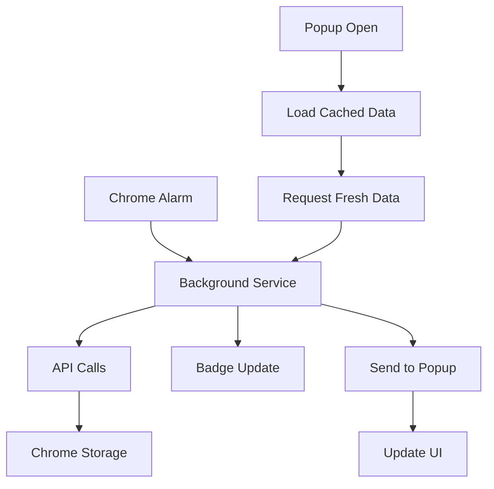

# CoinPeek - Technical Documentation

## Project Overview
A Chrome extension that provides real-time cryptocurrency prices, gas fees, and conversion tools for Bitcoin and Ethereum.

**Version:** 1.1.1
**Framework:** Vanilla JavaScript (Chrome Extension Manifest V3)
**Repository:** github.com/devacc8/coinpeek

---

## Architecture

### Project Structure
```
coinpeek/
├── manifest.json              # Extension configuration
├── background-simple.js       # Service worker
├── popup/
│   ├── popup.html             # UI structure
│   ├── popup.css              # Styles
│   └── popup.js               # Frontend logic
├── config/
│   └── constants.js           # Centralized configuration
├── utils/
│   └── formatters.js          # Shared formatting utilities
└── icons/                     # Extension icons
```

### 🔧 Core Components

#### 1. Background Service Worker (`background-simple.js`)
- **Purpose**: Handles API calls, data caching, badge updates
- **Key Features**:
  - Fetches data every 1 minute via Chrome alarms
  - Multiple API fallbacks for reliability
  - Chrome storage integration
  - Badge price display

#### 2. Popup Interface (`popup/`)
- **Purpose**: User interface for price display and conversion
- **Key Features**:
  - Real-time price updates
  - Gas fee monitoring
  - Currency conversion tool
  - Optimized DOM element caching

#### 3. Shared Utilities
- **Config** (`config/constants.js`): Centralized configuration
- **Formatters** (`utils/formatters.js`): Price/percentage formatting

---

## 🔌 API Integration

### Primary APIs
1. **CoinGecko API** - Cryptocurrency prices
   - Endpoint: `/simple/price?ids=bitcoin,ethereum&vs_currencies=usd&include_24hr_change=true`
   - Rate limit: Public API limits

2. **Blocknative API** - Ethereum gas fees
   - Endpoint: `/gasprices/blockprices?chainid=1`
   - Confidence levels: 70% (low), 80% (standard), 95% (fast)

### Bitcoin Gas Fee APIs (with fallbacks)
1. **mempool.space** - Primary
2. **blockchain.info** - Secondary  
3. **blockchair.com** - Tertiary

### Error Handling
- Multiple API fallbacks
- Graceful degradation to cached data
- Default values when APIs fail

---

## 💾 Data Flow



### Storage Schema
```javascript
{
  cryptoData: {
    prices: {
      bitcoin: { price: number, change24h: number },
      ethereum: { price: number, change24h: number }
    },
    gas: {
      bitcoin: { low: number, standard: number, fast: number } | null,
      ethereum: { low: number, standard: number, fast: number }
    },
    timestamp: number
  }
}
```

---

## 🎨 UI Components

### Price Cards
- Real-time price display
- 24h change indicators (green/red)
- Inline gas fee information

### Converter
- Multi-currency support (BTC, ETH, USD)
- Real-time conversion
- Currency swap functionality

### Header
- Status indicator (connected/loading/error)
- Manual refresh button
- Last update timestamp

---

## ⚡ Performance Optimizations

### Version 1.1.0 Improvements
1. **Eliminated Code Duplication**
   - Removed duplicate background files
   - Centralized formatting functions
   - Unified constants management

2. **DOM Optimization**
   - Cached all DOM elements at initialization
   - Reduced repeated `getElementById` calls
   - Improved rendering performance

3. **Architecture Improvements**
   - Removed direct API calls from popup
   - Centralized all API logic in background service
   - Better error handling and fallbacks

### Memory & Performance
- **DOM Caching**: ~30% reduction in DOM queries
- **Code Size**: ~25% reduction in total JavaScript
- **API Calls**: Unified through background service only

---

## 🔒 Security & Permissions

### Required Permissions
- `storage`: Local data caching
- `alarms`: Periodic updates
- `host_permissions`: API access to cryptocurrency services

### Content Security Policy
```json
{
  "extension_pages": "script-src 'self'; object-src 'self'"
}
```

### Data Privacy
- No user data collection
- No external analytics
- All data stored locally in Chrome storage

---

## 🚀 Development Guidelines

### Adding New Features
1. Update `config/constants.js` for new configuration
2. Add utilities to `utils/` if reusable
3. Follow the established DOM caching pattern
4. Use centralized formatters for consistency

### API Integration
1. Add new APIs to background service only
2. Include fallback mechanisms
3. Update `host_permissions` in manifest.json
4. Test with network failures

### Code Standards
- Use ES6+ features
- Implement proper error handling
- Follow existing naming conventions
- Cache DOM elements in constructor

---

## 🐛 Debugging

### Chrome DevTools
1. **Background Service**: 
   - Go to `chrome://extensions/`
   - Click "Service Worker" link
   - View console logs

2. **Popup Interface**:
   - Right-click popup → "Inspect"
   - Standard DevTools available

### Common Issues
- **API Rate Limits**: Check network tab for 429 errors
- **Storage Issues**: Clear extension data in Chrome settings
- **Service Worker Sleep**: Chrome suspends inactive workers

### Logging
- Background service logs all API calls
- Popup logs data updates and user interactions
- Error messages include context for debugging

---

## 📋 Testing

### Manual Testing Checklist
- [ ] Price display accuracy
- [ ] Gas fee updates
- [ ] Currency conversion
- [ ] Refresh functionality
- [ ] Badge updates
- [ ] Network failure handling

### API Testing
- [ ] Primary API responses
- [ ] Fallback API behavior
- [ ] Rate limit handling
- [ ] Invalid data handling

---

## 🔄 Update Procedures

### Version Updates
1. Update version in `manifest.json`
2. Test all functionality
3. Update documentation
4. Package for distribution

### Configuration Changes
- Modify `config/constants.js`
- Test with new settings
- Document breaking changes

---

## 📞 Support & Maintenance

### Monitoring
- Check Chrome Web Store reviews
- Monitor API service status
- Track error reports in logs

### Regular Maintenance
- Update API endpoints if changed
- Review and update fallback services
- Performance optimization reviews

---

*For user documentation, see README.md*